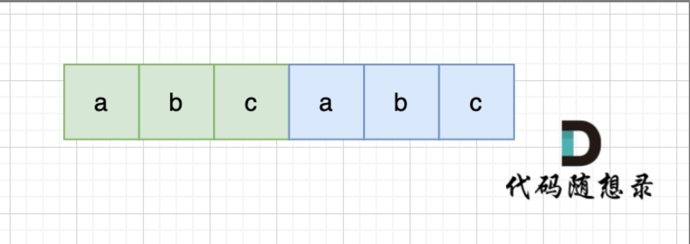
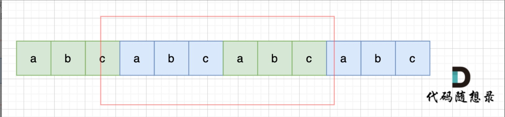

[TOC]


# 一.快慢指针法

## 快慢指针寻找链表中间节点

初始时，快指针fast和慢指针slow均指向链表的左端点。我们将快指针fast向右移动两次的同时，将慢指针slow向右移动一次，直到快指针到达边界（即快指针到达右端点或快指针的下一个节点是右端点）。此时，慢指针slow对应的元素就是中位数。

快慢指针同时从头节点开始，快指针每次走两步，慢指针每次走一步。当快指针走到链表末尾的时候，慢指针正好到达链表的中间结点。（注意特况特判，即链表中有0或1个结点时）


```c++
/**
 * Definition for singly-linked list.
 * struct ListNode {
 *     int val;
 *     ListNode *next;
 *     ListNode() : val(0), next(nullptr) {}
 *     ListNode(int x) : val(x), next(nullptr) {}
 *     ListNode(int x, ListNode *next) : val(x), next(next) {}
 * };
 */
class Solution {
public:
    ListNode* middleNode(ListNode* head) {
        if(head==nullptr){return nullptr;}
        if(head->next==nullptr) return head;
        ListNode* fast = head->next->next;
        ListNode* slow = head->next;
        while(fast!=nullptr&&fast->next!=nullptr){
            slow = slow->next;
            fast = fast->next->next;
        }
        return slow;
    }
};
```

## 判断链表中是否有环

设想一个情景：两个人在赛跑，A速度快，B速度慢，若是存在环(勺状图)，A和B总是会相遇的，相遇时A所经过的路径的长度要比B多若干个环的长度。

在本题中，快慢指针的思想即是如此，快指针每次走两步，慢指针每次走一步，它们同时从头节点出发。如果二者相遇，则说明存在环；如果快指针到达链表尾NULL，则说明不存在环。

```c++
/**
 * Definition for singly-linked list.
 * struct ListNode {
 *     int val;
 *     ListNode *next;
 *     ListNode(int x) : val(x), next(NULL) {}
 * };
 */
class Solution {
public:
    bool hasCycle(ListNode *head) {
        ListNode* fast = head;
        ListNode* slow = head;
        while(fast!=NULL && fast->next!=NULL){
            fast = fast->next->next;
            slow = slow->next;
            if(slow==fast) return true;
        }
        return false;
    }
};
```

## 判断链表中是否有环并找到环的起点

如果链表中有环，那么说明快慢指针会在环中的某位置相遇。此时，应让二者分别从head和相遇节点同时开始每次走一步。当它们再次相遇时，二者所在的结点便是环的入口结点。


```c++
/**
 * Definition for singly-linked list.
 * struct ListNode {
 *     int val;
 *     ListNode *next;
 *     ListNode(int x) : val(x), next(NULL) {}
 * };
 */
class Solution {
public:
    ListNode *detectCycle(ListNode *head) {
        ListNode* fast = head;
        ListNode* slow = head;
        while(fast!=NULL && fast->next!=NULL){
            fast = fast->next->next;
            slow = slow->next;
            if(slow == fast){
                ListNode* index1 = fast;
                ListNode* index2 = head;
                while(index1 != index2){
                    index1=index1->next;
                    index2=index2->next;
                }
                return index2;
            }
        }
        return NULL;
    }
};
```

## 重排链表

解题思路

1. 快慢指针找到中间结点

2. 后半条链反转链表

3. 合并两条链表

	```c++
	/**
	 * Definition for singly-linked list.
	 * struct ListNode {
	 *     int val;
	 *     ListNode *next;
	 *     ListNode() : val(0), next(nullptr) {}
	 *     ListNode(int x) : val(x), next(nullptr) {}
	 *     ListNode(int x, ListNode *next) : val(x), next(next) {}
	 * };
	 */
	class Solution {
	public:
	    ListNode* middleNode(ListNode* head){
	        if(head==nullptr) return nullptr;
	        if(head->next == nullptr) return head;
	        ListNode* fast = head->next->next;
	        ListNode* slow = head->next;
	        while(fast!=nullptr && fast->next!=nullptr){
	            slow = slow->next;
	            fast = fast->next->next;
	        }
	        return slow;
	    }
	 
	    ListNode* reverseList(ListNode* head){
	        if(head==nullptr) return nullptr;
	        if(head->next == nullptr) return head;
	        ListNode* pre = nullptr;
	        ListNode* cur = head;
	        while(cur!=nullptr){
	            ListNode* tmp = cur->next;
	            cur->next = pre;
	            pre = cur;
	            cur = tmp;
	        }
	        return pre;
	    }
	 
	    void mergeList(ListNode* head1,ListNode* head2){
	        ListNode* tmp1,* tmp2;
	        while(head1!=nullptr && head2!=nullptr){
	            tmp1 = head1->next;
	            tmp2 = head2->next;
	 
	            head1->next = head2;
	            head1 = tmp1;
	 
	            head2->next = head1;
	            head2 = tmp2;
	        }
	    }
	 
	 
	    void reorderList(ListNode* head) {
	        if(head==nullptr) return;
	        ListNode* mid = middleNode(head);
	        ListNode* h1 = head;
	        ListNode* h2 = mid->next;
	        mid->next = nullptr;
	        h2 = reverseList(h2);
	        mergeList(h1,h2);
	    }
	};
	```

	

## 删除链表中的倒数第N个结点

解题思路
总体目标
快指针先走几步，然后快慢指针一起走，最终快指针指向null的时候，慢指针正好指向要删除结点的前一个结点，借慢指针来实现倒数第N个结点的删除。

实现方法
创建一个虚拟头结点，并使其指向当前链表的头结点。

slow指针从虚拟头结点dummyhead出发，fast指针从头结点head出发。（如果都从head出发，则实现的是slow指针最后指向要删除的结点。正如前面所说，为了便于删除，要使得慢指针正好指向要删除结点的前一个结点。因此，slow从dummyhead出发，fast从head出发）

开始时，fast指针先行N步，slow指针原地待命。

然后，fast指针和slow指针同时向后迈步，每次迈一步，直至fast指针指向NULL。此时，slow指针指向的就正好是要删除结点的前一个结点。在此进行删除工作即可。

注意
本题中确保了N不会大于链表长度，因此也就不需要考虑要删除的结点不存在的问题。

否则，应将N与链表长度作比较，确定倒数第N个链表结点存在后，再进行上述的删除操作。

```c++
/**
 * Definition for singly-linked list.
 * struct ListNode {
 *     int val;
 *     ListNode *next;
 *     ListNode() : val(0), next(nullptr) {}
 *     ListNode(int x) : val(x), next(nullptr) {}
 *     ListNode(int x, ListNode *next) : val(x), next(next) {}
 * };
 */
class Solution {
public:
    ListNode* removeNthFromEnd(ListNode* head, int n) {
        ListNode* dummyhead = new ListNode(0, head);
        ListNode* fast = head;
        ListNode* slow = dummyhead;
        for (int i = 0; i < n; ++i) {
            fast = fast->next;
        }
        while (fast!=nullptr) {
            fast = fast->next;
            slow = slow->next;
        }
        ListNode* d = slow->next;
        slow->next = slow->next->next;
        ListNode* ans = dummyhead->next;
        delete d;
        delete dummyhead;
        return ans;
    }
};
```

# 二.最长有效括号

**栈**

撇开方法一提及的动态规划方法，相信大多数人对于这题的第一直觉是找到每个可能的子串后判断它的有效性，但这样的时间复杂度会达到 O(n^3)，无法通过所有测试用例。但是通过栈，我们可以在遍历给定字符串的过程中去判断到目前为止扫描的子串的有效性，同时能得到最长有效括号的长度。

具体做法是我们始终保持栈底元素为当前已经遍历过的元素中「最后一个没有被匹配的右括号的下标」，这样的做法主要是考虑了边界条件的处理，栈里其他元素维护左括号的下标：

对于遇到的每个 ‘(’ ，我们将它的下标放入栈中
对于遇到的每个 ‘)’ ，我们先弹出栈顶元素表示匹配了当前右括号：
如果栈为空，说明当前的右括号为没有被匹配的右括号，我们将其下标放入栈中来更新我们之前提到的「最后一个没有被匹配的右括号的下标」
如果栈不为空，当前右括号的下标减去栈顶元素即为「以该右括号为结尾的最长有效括号的长度」
我们从前往后遍历字符串并更新答案即可。

需要注意的是，如果一开始栈为空，第一个字符为左括号的时候我们会将其放入栈中，这样就不满足提及的「最后一个没有被匹配的右括号的下标」，为了保持统一，我们在一开始的时候往栈中放入一个值为 −1 的元素。

## code

```c++
class Solution {
public:
    int longestValidParentheses(string s) {
        int maxans = 0;
        stack<int> stk;
        stk.push(-1);
        for (int i = 0; i < s.length(); i++) {
            if (s[i] == '(') {
                stk.push(i);
            } else {
                stk.pop();
                if (stk.empty()) {
                    stk.push(i);
                } else {
                    maxans = max(maxans, i - stk.top());
                }
            }
        }
        return maxans;
    }
};

```

# 三.二进制计算

  这道题的关键就是让你用代码模拟加法的运算过程。**加法的模拟可以理解为是一个通用模式，需要你用一个 `carry` 变量记录并正确进位**

## code

``````c++
class Solution {
public:
    string addBinary(string a, string b) {
        // 先把输入的这两个二进制串反转，低位放在前面，方便处理进位
        reverse(a.begin(), a.end());
        reverse(b.begin(), b.end());
        
        // 存储结果
        string result;
        
        int m = a.size(), n = b.size();
        // carry 记录进位
        int carry = 0;
        int i = 0;
        
        // 开始类似 [2. 两数相加](#2) 的加法模拟逻辑
        // 只是这里运算的是二进制字符串
        while (i < max(m, n) || carry > 0) {
            int val = carry;
            val += i < m ? (a[i] - '0') : 0;
            val += i < n ? (b[i] - '0') : 0;
            result += (val % 2) + '0';
            carry = val / 2;
            i++;
        }
        
        // 反转结果字符串
        reverse(result.begin(), result.end());
        return result;
    }
};
``````

# 四.移动匹配

当一个字符串s：abcabc，内部又重复的子串组成，那么这个字符串的结构一定是这样的：



也就是又前后又相同的子串组成。

那么既然前面有相同的子串，后面有相同的子串，用 s + s，这样组成的字符串中，后面的子串做前串，前后的子串做后串，就一定还能组成一个s，如图：



所以判断字符串s是否有重复子串组成，只要两个s拼接在一起，里面还出现一个s的话，就说明是又重复子串组成。

当然，我们在判断 s + s 拼接的字符串里是否出现一个s的的时候，要刨除 s + s 的首字符和尾字符，这样避免在s+s中搜索出原来的s，我们要搜索的是中间拼接出来的s。

## code

``````c++
class Solution {
public:
    bool repeatedSubstringPattern(string s) {
        string t = s + s;
        t.erase(t.begin()); 
        t.erase(t.end() - 1); // 掐头去尾
        if (t.find(s) != std::string::npos) 
            return true; // r
        return false;
    }
};
``````

# 五.c++分割字符串

## code

``````c++
vector<string> splitIntoWords(const string &sentence) {
        vector<string> words;
        stringstream ss(sentence);
        string word;
        while (ss >> word) {
            words.push_back(word);
        }
        return words;
    }
``````

# 六.寻找最长回文子串

**寻找回文串的问题核心思想是：从中间开始向两边扩散来判断回文串**，对于最长回文子串，就是这个意思：

```python
for 0 <= i < len(s):
    找到以 s[i] 为中心的回文串
    更新答案
```

找回文串的关键技巧是传入两个指针 `l` 和 `r` 向两边扩散，因为这样实现可以同时处理回文串长度为奇数和偶数的情况。

```python
for 0 <= i < len(s):
    # 找到以 s[i] 为中心的回文串
    palindrome(s, i, i)
    # 找到以 s[i] 和 s[i+1] 为中心的回文串
    palindrome(s, i, i + 1)
    更新答案
```

## code

``````c++
#include <string>
using namespace std;

class Solution {
public:
    string longestPalindrome(string s) {
        string res = "";
        for (int i = 0; i < s.length(); i++) {
            // 以 s[i] 为中心的最长回文子串
            string s1 = palindrome(s, i, i);
            // 以 s[i] 和 s[i+1] 为中心的最长回文子串
            string s2 = palindrome(s, i, i + 1);
            // res = longest(res, s1, s2)
            res = res.length() > s1.length() ? res : s1;
            res = res.length() > s2.length() ? res : s2;
        }
        return res;
    }

private:
    string palindrome(string s, int l, int r) {
        // 防止索引越界
        while (l >= 0 && r < s.length() && s[l] == s[r]) {
            // 向两边展开
            l--;
            r++;
        }
        // 返回以 s[l] 和 s[r] 为中心的最长回文串
        return s.substr(l + 1, r - l - 1);
    }
};
``````

# 七.字母异位词分组

异位词这类问题的关键在于，你如何迅速判断两个字符串是异位词，主要考察数据编码和哈希表的使用：

你是否可以找到一种编码方法，使得字母异位词的编码都相同？找到这种编码方式之后，就可以用一个哈希表存储编码相同的所有异位词，得到最终的答案。

[242. 有效的字母异位词](vscode-webview://0kodhb6i2b8fhjfdmokifcrgdvlcji9h1lc7g75uqld2lvrjr0cg/problems/valid-anagram) 考察了异位词的编码问题，对字符串排序可以是一种编码方案，如果是异位词，排序后就变成一样的了，但是这样时间复杂度略高，且会修改原始数据。更好的编码方案是利用每个字符的出现次数进行编码，也就是下面的解法代码。

**标签：哈希表，[数组](https://labuladong.online/algo/)**

## code

``````c++
#include <vector>
#include <string>
#include <unordered_map>
#include <list>

class Solution {
public:
    std::vector<std::vector<std::string>> groupAnagrams(std::vector<std::string>& strs) {
        // 编码到分组的映射
        std::unordered_map<std::string, std::list<std::string>> codeToGroup;
        for (const std::string& s : strs) {
            // 对字符串进行编码
            std::string code = encode(s);
            // 把编码相同的字符串放在一起
            codeToGroup[code].push_back(s);
        }

        // 获取结果
        std::vector<std::vector<std::string>> res;
        for (auto& group : codeToGroup) {
            res.push_back(std::vector<std::string>(group.second.begin(), group.second.end()));
        }

        return res;
    }

private:
    // 利用每个字符的出现次数进行编码
    std::string encode(const std::string& s) {
        std::string count(26, '0');
        for (char c : s) {
            int delta = c - 'a';
            count[delta]++;
        }
        return count;
    }
};
``````

